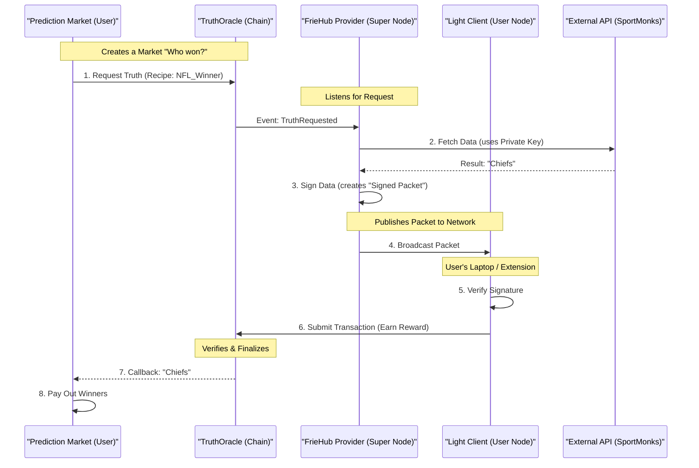

# TaaS Ecosystem Map

This document visually explains how the entire FrieHub TaaS ecosystem works, from the end-user application down to the individual node processes.

## 1. The High-Level Flow (Life of a Request)

This diagram shows how data flows from a consumer (Prediction Market) through the TaaS network and back.



---

## 2. The Physical Architecture (Component Map)

How the code is structured across repositories and services.

```mermaid
graph TD
    subgraph "Application Layer (Consumers)"
        PM[Prediction Market App]
        DeFi[DeFi Protocol]
        RWA[Real World Asset]
    end

    subgraph "The TaaS Network (The Truth)"
        Oracle[Smart Contract: TruthOracleV2]
        
        subgraph "Data Provider Layer"
            Provider[FrieHub Super Node]
            API_Keys[API Keys (SportMonks, etc)]
            Provider --> API_Keys
        end
        
        subgraph "Verification Layer (DePIN)"
            Client1[Light Client (Chrome Ext)]
            Client2[Light Client (CLI Node)]
            Client3[Light Client (Desktop App)]
        end
    end

    PM -->|Reads| Oracle
    Provider -->|Publishes Signed Data| Client1
    Provider -->|Publishes Signed Data| Client2
    Client1 -->|Submits TX| Oracle
    Client2 -->|Submits TX| Oracle
```

---

## 3. Inside the `truth-node` (The Engine)

The `truth-node` (also called the Sentinel) is the software that drives the **Data Provider Layer**. It is the "brain" that knows how to fetch and process data.

### Internal Structure
The codebase in `taas-core/nodes/truth-node` is organized into a robust pipeline:

1.  **`TruthRelayer` (The Ear)**:
    *   **Role**: Listens to the blockchain events (`TruthRequested`).
    *   **Action**: When it hears a request, it creates a "Job" and pushes it to a Queue.
    *   **Analogy**: The receptionist taking orders.

2.  **`TruthQueue` (The Buffer)**:
    *   **Role**: Manages the workload. Ensuring we don't crash if 1000 requests come in at once.
    *   **Tech**: Redis (BullMQ) or Memory Queue (Lite Mode).
    *   **Analogy**: The ticket line in a kitchen.

3.  **`WorkerEngine` (The Brain)**:
    *   **Role**: Picks up a job and *executes* the Recipe.
    *   **Action**: Calls `@friehub/execution-engine` logic -> Fetches Data -> Signs it.
    *   **Analogy**: The chef cooking the meal.

4.  **`RecipeExecutor` (The Hands)**:
    *   **Role**: The specific script runner.
    *   **Action**: Knows how to talk to SportMonks, calculate averages, or parse JSON interactively.
    *   **Internal Tool**: Uses `data-feeds` adapters.

### Diagram: Inside the Node

```mermaid
flowchart LR
    Blockchain(TruthOracle Contract)
    
    subgraph "Truth Node (Sentinel)"
        Relayer[TruthRelayer Service]
        Queue[Job Queue (Redis)]
        Worker[Worker Engine]
        Executor[Recipe Executor]
        Signer[EIP-712 Signer]
    end
    
    APIs((External APIs))

    Blockchain -- "Event: Requested" --> Relayer
    Relayer -- "Add Job" --> Queue
    Queue -- "Process Job" --> Worker
    Worker -- "Run Logic" --> Executor
    Executor -- "Fetch" --> APIs
    APIs -- "Data" --> Executor
    Executor -- "Result" --> Worker
    Worker -- "Sign Payload" --> Signer
    Signer -- "Signed Packet" --> Blockchain
```

## 4. Why this matters for us?

*   **Modular**: If we want to add a new API (e.g., Weather), we only update `data-feeds` and the `Recipe`. The core Node logic (`Relayer` -> `Queue` -> `Worker`) stays exactly the same.
*   **Scalable**: The Queue system means one node can handle thousands of requests per minute without dropping them.
*   **Secure**: The `Signer` acts as the final gatekeeper. Even if the data fetch logic has a bug, the signature creates accountability.
