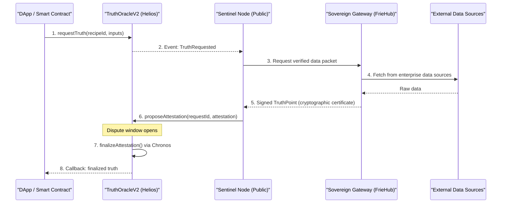
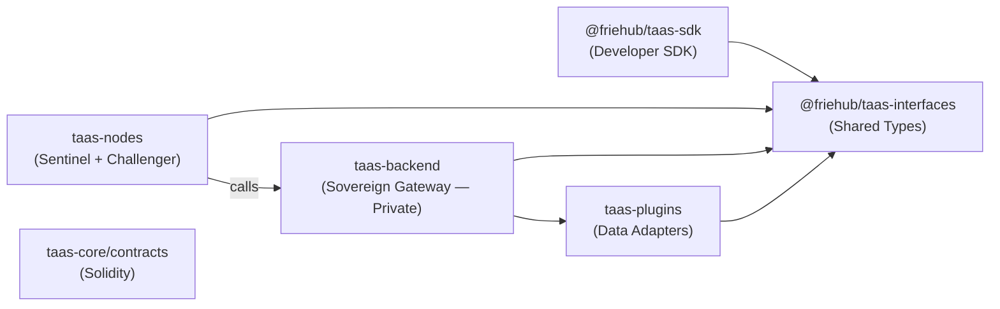

# TaaS Architecture

This page explains how the TaaS protocol operates at a conceptual level — covering the flow of a truth request from consumer to on-chain finalization, and how each layer of the ecosystem contributes.

## The Life of a Truth Request

Every truth request follows a structured pipeline:

---

## Layered Architecture

TaaS is composed of four distinct layers, each with a clear responsibility boundary:

### Layer 1: Consumer Layer

Any smart contract or DApp that needs a verifiable real-world fact. Consumers interact exclusively with the **TruthOracleV2** contract:
- Call `requestTruth(recipeId, inputs)` to initiate a request.
- Implement the `ITruthConsumer` interface to receive the finalized result via callback.

### Layer 2: Protocol Layer (Helios Blockchain)

The on-chain enforcement layer. Immutable contracts enforce the rules of truth:

| Contract | Role |
| :--- | :--- |
| `TruthOracleV2` | Accepts requests, manages dispute windows, triggers finalization |
| `NodeRegistry` | Tracks registered Sentinels and Challengers with their staked bonds |
| `SourceRegistry` | Tracks registered data sources and their reputation scores |
| `TAASToken` | Powers staking, fees, and node incentives |

**Chronos integration**: Helios's native on-chain automation (`Chronos`) automatically finalizes truth requests after the dispute window expires — no manual intervention required.

### Layer 3: Node Network (Public, Decentralized)

**Sentinel Nodes** are lightweight public clients that any person can run. They:
- Monitor the blockchain for `TruthRequested` events.
- Request a cryptographically signed data certificate from the Sovereign Gateway.
- Submit the `proposeAttestation` transaction on-chain.
- Earn `$TAAS` rewards for validated truth.

**Challenger Nodes** audit every proposal:
- Re-verify the data against the gateway.
- Raise a dispute and earn slashing rewards if a Sentinel submitted incorrect data.

Neither node type ever directly touches enterprise API keys or internal execution logic.

### Layer 4: Sovereign Gateway (FrieHub — Private)

The Sovereign Gateway is FrieHub's proprietary backend. It is the source of **enterprise-grade data access and cryptographic signing**. Every data packet leaving the gateway is:
- Fetched using curated, high-reliability external APIs.
- Processed through FrieHub's proprietary data quality and consensus layer.
- Signed with the gateway's identity key — enabling Sentinel nodes to verify authenticity without having access to any underlying API secrets.

> [!NOTE]
> The Gateway's internal logic is proprietary to FrieHub. Sentinel nodes interact with it only via a well-defined external interface — they receive signed certificates, not raw data or implementation access.

---

## Physical Package Overview

The TaaS monorepo is organized into focused packages with clear public interfaces:

---

## The Keyless Design

A core security property of TaaS is that **Sentinel nodes never hold secrets**:

- No API keys from SportMonks, Binance, or any other provider.
- No raw internet access to enterprise data.
- No knowledge of the gateway's internal logic.

Sentinels only know: "I received a signed certificate from a trusted gateway identity. I will relay it."

This separation ensures that even if a Sentinel is compromised, it cannot leak proprietary data access or allow API abuse. The security boundary is the gateway's ECDSA identity — verifiable by anyone on-chain.

---

## Why Helios?

TaaS is not simply deployed on Helios — it is architecturally native to it:

| Helios Feature | TaaS Integration |
| :--- | :--- |
| **Chronos** (native automation) | Truth requests self-finalize after the dispute window — no manual `finalize()` calls |
| **Hyperion** (async oracle) | Recipes can verify L1 Ethereum or Bitcoin state as a data source |
| **Low fees** | Makes micro-truth requests economically viable |
