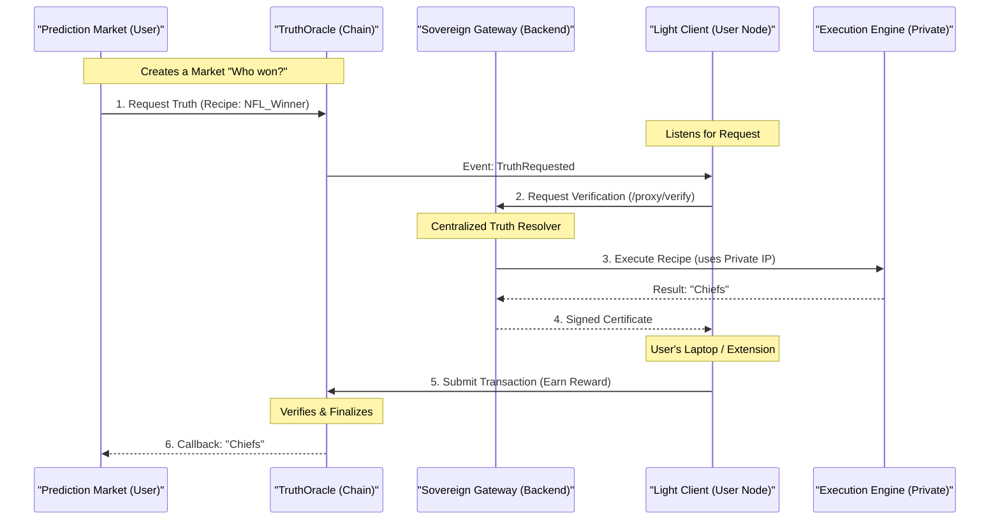
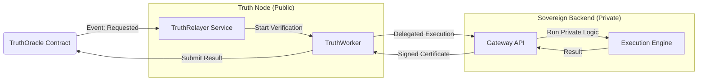

# TaaS Ecosystem Map

This document visually explains how the entire FrieHub TaaS ecosystem works, from the end-user application down to the individual node processes.

## 1. The High-Level Flow (Life of a Request)

This diagram shows how data flows from a consumer (Prediction Market) through the TaaS network and back.



---

## 2. The Physical Architecture (Component Map)

How the code is structured across repositories and services.

```mermaid
graph TD
    subgraph "Application Layer (Consumers)"
        PM[Prediction Market App]
        DeFi[DeFi Protocol]
    end

    subgraph "Sovereign Backend (Private)"
        Gateway[Sovereign Gateway API]
        Engine[@friehub/execution-engine]
        Feeds[@friehub/data-feeds]
        Gateway --> Engine
        Engine --> Feeds
    end

    subgraph "The Public Network (Thin Clients)"
        Oracle[Smart Contract: TruthOracleV2]
        Node1[Truth Node]
        Node2[Challenger Lite]
        Ext[Chrome Extension]
    end

    PM -->|Reads| Oracle
    Node1 -->|Verify Request| Gateway
    Node2 -->|Audit Request| Gateway
    Gateway -->|Signed Payload| Node1
    Node1 -->|Submit TX| Oracle
```

---

## 3. Inside the `truth-node` (The Thin Client)

The `truth-node` is a lightweight process that manages the interaction between the blockchain and the Sovereign Gateway. It carries **no private logic and no secret API keys**.

### Internal Structure

1.  **`TruthRelayer` (The Listener)**:
    *   **Role**: Listens to the blockchain events (`TruthRequested`).
    *   **Action**: Passes the request ID and recipe template to the worker.

2.  **`TruthWorker` (The Coordinator)**:
    *   **Role**: Coordinates the verification flow.
    *   **Action**: Calls the **Sovereign Gateway**'s `/proxy/verify` endpoint.

3.  **`GatewayClient` (The Connector)**:
    *   **Role**: Standardized SDK component for backend communication.
    *   **Action**: Handles circuit breaking and retries for gateway calls.

### Diagram: The Keyless Flow



## 4. Why this matters for us?

*   **Modular**: If we want to add a new API (e.g., Weather), we only update `data-feeds` and the `Recipe`. The core Node logic (`Relayer` -> `Queue` -> `Worker`) stays exactly the same.
*   **Scalable**: The Queue system means one node can handle thousands of requests per minute without dropping them.
*   **Secure**: The `Signer` acts as the final gatekeeper. Even if the data fetch logic has a bug, the signature creates accountability.
