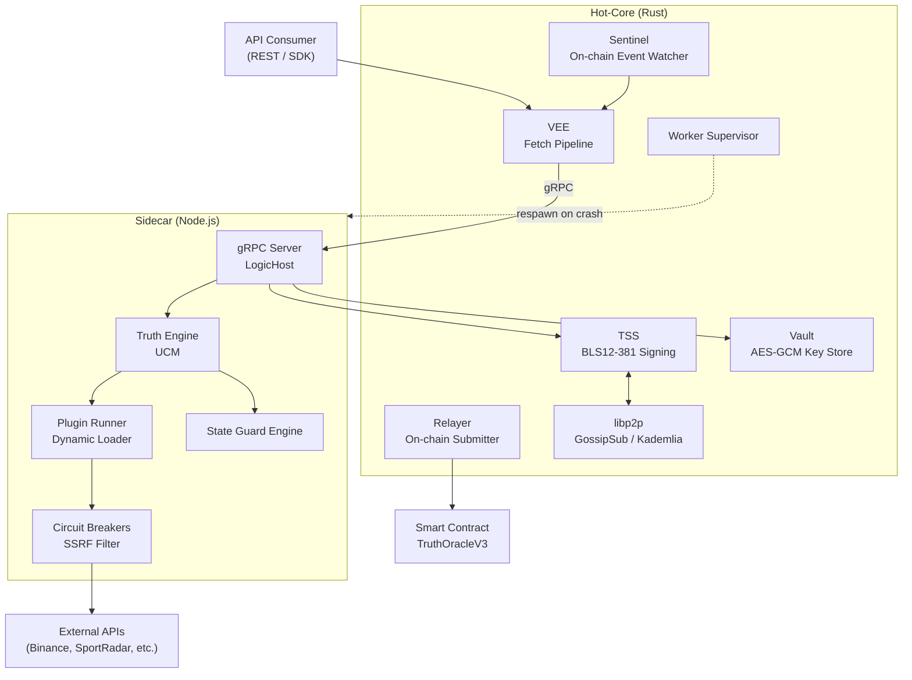
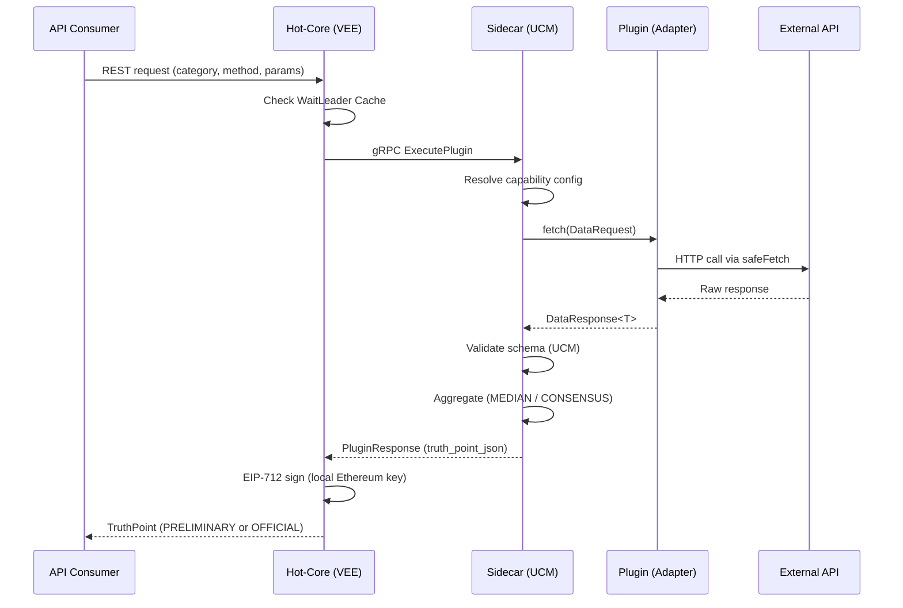
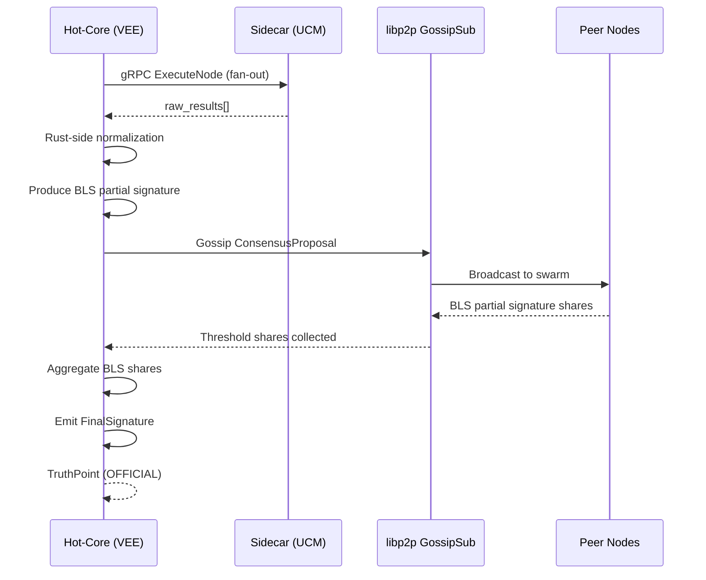

# System Architecture

This page documents the internal architecture of the TaaS Gateway — how Hot-Core and the Sidecar are organized, how a request flows through the system, and how the Protobuf contract between them is structured.

---

## 1. Subsystem Map

The following diagram shows all major subsystems and their ownership boundaries.



---

## 2. Hot-Core Subsystems

### 2.1 VEE — Verifiable Execution Environment

The VEE is the central fetch pipeline inside Hot-Core. It coordinates the full request lifecycle from receipt to signed proof.

- **WaitLeader Cache** — Prevents duplicate simultaneous fetches for the same request key. If a fetch is already in-flight for a given `(category, method, params)` tuple, subsequent requests wait for the first result rather than triggering duplicate plugin executions.
- **Priority-Based Fetching** — Each node is assigned a deterministic priority score for a given request. In Mesh mode, lower-priority nodes defer execution to avoid redundant network calls.
- **Quota Manager** — Per-source, per-minute rate limiting backed by persistent storage. Prevents individual plugin sources from exceeding their configured API rate limits.

### 2.2 TSS — Threshold Signature Scheme

BLS12-381 threshold signing for Mesh Network mode.

1. The local node produces a BLS partial signature over the request result.
2. The partial signature is gossiped to peers over libp2p GossipSub.
3. The first node to collect enough shares (meeting the configured threshold) aggregates them into a single BLS aggregate signature and broadcasts the `FinalSignature`.
4. If aggregation times out before threshold is reached, the request falls back to local single-key EIP-712 signing.

BLS keys are stored encrypted in the Vault (`bls_key.enc`). TSS sessions are tracked per `request_id` using a concurrent `DashMap`.

### 2.3 Worker Supervisor

The Worker Supervisor is a dedicated Hot-Core task that monitors the Sidecar process. If the Sidecar exits for any reason — unhandled plugin exception, OOM, signal — the Supervisor respawns it immediately. This makes Sidecar crashes equivalent to a single-request failure from the network's perspective.

### 2.4 Vault

An AES-GCM encrypted file store for all node secrets:

| Secret | File |
| :--- | :--- |
| Ethereum private key | `eth_key.enc` |
| BLS signing key | `bls_key.enc` |
| libp2p peer identity | `p2p_identity.enc` |
| Plugin API keys | Stored per-plugin in Vault, injected at fetch time |

Nothing sensitive is ever written to plaintext configuration files.

### 2.5 Sentinel and Relayer

- **Sentinel** — Subscribes to `TruthRequested` events on the `TruthOracleV3` smart contract. When an event fires, it constructs a request and dispatches it into the VEE pipeline autonomously, without any external trigger.
- **Relayer** — If the node is configured as `is_primary_relayer`, it submits signed TruthPoints on-chain via `propose_outcome` after the VEE pipeline completes. Only one node in a Mesh group acts as primary relayer per request round.

---

## 3. Sidecar Subsystems

### 3.1 gRPC Server — LogicHost

The Sidecar implements the `LogicHost` gRPC service defined in `proto/gateway.proto`. Hot-Core is the client; the Sidecar is the server. Four RPCs are defined:

| RPC | Direction | Purpose |
| :--- | :--- | :--- |
| `ExecutePlugin` | Hot-Core → Sidecar | SDK simulation path. Runs plugin, aggregates, returns TruthPoint JSON. |
| `ExecuteNode` | Hot-Core → Sidecar | Production VEE path. Fan-out per source, returns `raw_results[]` for Rust-side normalization. |
| `Discover` | Hot-Core → Sidecar | Resolves dynamic discovery options (e.g., available match IDs for a tiered input). |
| `ReloadPlugin` | Hot-Core → Sidecar | Hot-reloads a plugin without restarting the Sidecar. |

### 3.2 UCM — Unified Capability Model

The Truth Engine (`lib/ucm/`) is the central dispatcher of the Sidecar. On startup it reads all JSON manifests from `lib/ucm/registry/`, mapping method names to their capability configuration (schema, aggregation strategy, `min_sources`). At request time it:

1. Resolves the correct plugin for `(category, method)`.
2. Fetches from all registered sources in parallel.
3. Validates each raw result against the capability schema.
4. Applies the configured aggregation strategy.
5. Enforces the `min_sources` Byzantine quorum guard.

### 3.3 Plugin Runner

The Plugin Runner (`lib/discovery/`) dynamically loads TypeScript adapters from disk entries in `plugin-manifest.json`. Each adapter is wrapped in a `LogicRegistry` that manages lifecycle: `initialize()` on load and `dispose()` on unregister. Plugins that fail to preload log a warning but do not abort startup for other plugins.

---

## 4. Request Lifecycle

### Sovereign Mode



### Mesh Network Mode



---

## 5. The Protobuf Contract Boundary

All communication between Hot-Core and the Sidecar is defined in `proto/gateway.proto`. This file is the interface contract between two separate language runtimes. Evolution rules are strictly enforced:

- **Do not remove or renumber existing fields.** Field numbers are used by the binary encoding; changing them is a breaking change for all nodes on the network.
- **Adding new optional fields is safe.** Older nodes will ignore unknown fields.
- **Any change to `proto/` requires a reviewer from the gateway security team.** The Protobuf boundary is a trust boundary.

### ErrorCode Enum

The `ErrorCode` enum is shared across both the gRPC response messages and the TypeScript `ErrorCode` utility. It provides machine-readable failure codes for all error paths:

```protobuf
enum ErrorCode {
    OK                 = 0;
    INTERNAL           = 1;
    UNAUTHORIZED       = 2;
    CAPABILITY_FAILED  = 3;
    TIMEOUT            = 4;
    INVALID_ARGUMENT   = 5;
    NOT_FOUND          = 6;
    CONSENSUS_FAILED   = 7;
    SCHEMA_VIOLATION   = 8;
    SIGNING_FAILED     = 9;
    RATE_LIMITED       = 10;
    INSUFFICIENT_QUOTA = 11;
    STALE_DATA         = 12;
    PROVIDER_ERROR     = 13;
}
```

See [Fault Model and Error Codes](/gateway/fault-isolation) for the full reference with context and suggested actions.

---

## 6. Repository Layout

```
taas-gateway/
├── rust/
│   └── hot-core/              # Rust binary — P2P, TSS, VEE, Supervision, Relayer
│       └── src/
│           ├── core/          # State, Vault, Supervisor, Types
│           └── features/      # p2p, tss, vee, api, cli, node
├── ts/
│   ├── sidecar/               # Node.js sidecar — UCM, plugins, gRPC server
│   │   └── src/
│   │       ├── handlers/      # gRPC handler implementations
│   │       └── lib/
│   │           ├── ucm/       # Truth Engine, schema validator, aggregation strategies
│   │           ├── discovery/ # Plugin loader, LogicRegistry
│   │           ├── guards/    # State Guard Engine
│   │           ├── resilience/# Circuit Breakers, SSRF filter
│   │           └── platform/  # Logger, metrics, gRPC interceptors
│   └── interfaces/            # Shared TypeScript types (DataSource, TruthPoint, etc.)
├── proto/                     # Protobuf definitions — the Rust/TS contract boundary
│   ├── gateway.proto          # LogicHost service, all message types, ErrorCode enum
│   ├── attestation.proto      # SourceAttestation message
│   ├── health.proto           # Health check service
│   └── recipe.proto           # Recipe node graph messages
├── scripts/                   # Dev and ops scripts (swarm.sh, audit-all.sh)
├── docs/                      # Extended documentation
└── .github/workflows/         # CI, Verify, Release pipelines
```
