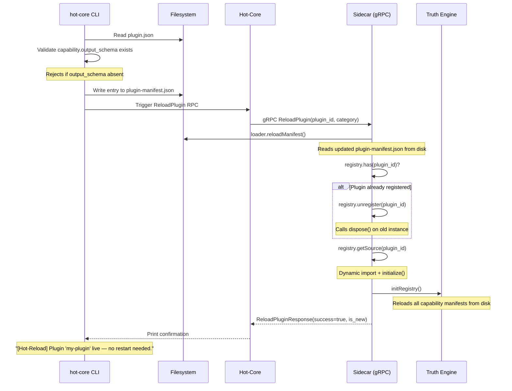

# Hot-Reload System

The TaaS Gateway supports live plugin installation and reload without restarting the Sidecar process. A plugin can go from source code to live consensus participation in a single CLI command, with zero downtime for other plugins.

---

## 1. The Hot-Install Flow

When you run `hot-core plugin install ./my-plugin`, the following sequence executes:



---

## 2. What Happens During a Reload

### Step 1 — Manifest Reload

`loader.reloadManifest()` re-reads `plugin-manifest.json` from disk. This allows the Sidecar to reflect the newly installed plugin entry without a process restart.

### Step 2 — Unregister the Old Instance

If a plugin with the same `id` was already loaded (i.e., this is an update, not a first install), the registry calls `dispose()` on the old adapter instance before discarding it. This releases any connections or timers the adapter may have held open. The `is_new` field in the response tells the caller whether this was a fresh install or an upgrade.

### Step 3 — Dynamic Import

`registry.getSource(plugin_id)` triggers `NodePluginLoader` to dynamically import the plugin's module from disk, call `initialize()` on the new instance, and register it in the `LogicRegistry` under its `id`.

### Step 4 — UCM Re-initialization

`initRegistry()` is called after the plugin is loaded. This re-runs the full UCM boot sequence: reloads capability manifests, rebuilds the `TruthEngine` method-to-config map, and cross-checks all loaded plugins against the capability files. This ensures that the updated `output_schema` (if the plugin was updated) is immediately in effect.

---

## 3. CLI-Only Context (Sidecar Not Running)

If the Sidecar is not running when you install a plugin (for example, during initial node setup), the CLI writes the manifest entry and skips the gRPC step. An advisory is printed:

```
[Install] plugin-manifest.json updated.
[Advisory] Sidecar is not running. Plugin 'my-plugin' will be loaded on next start.
```

The plugin will be picked up by `initRegistry` during normal Sidecar boot.

---

## 4. The ReloadPlugin gRPC Contract

The `ReloadPlugin` RPC is one of four operations defined on the `LogicHost` service in `gateway.proto`:

```protobuf
rpc ReloadPlugin(ReloadPluginRequest) returns (ReloadPluginResponse);

message ReloadPluginRequest {
    string plugin_id = 1;   // e.g. "my-price-source"
    string category  = 2;   // e.g. "crypto"
}

message ReloadPluginResponse {
    bool      success    = 1;
    string    error      = 2;
    bool      is_new     = 3;   // true = first install, false = update
    ErrorCode error_code = 4;
}
```

`X-Correlation-ID` metadata is required on the gRPC call for log traceability. If `plugin_id` or `category` are missing, the handler returns `ErrorCode.INVALID_ARGUMENT` immediately without touching the filesystem.

---

## 5. Failure Behaviour

| Failure | Response |
| :--- | :--- |
| `plugin.json` missing `output_schema` | CLI rejects installation. No manifest entry is written. |
| Dynamic import fails (syntax error, missing dependency) | `getSource()` throws. The old plugin instance (if any) is already unregistered. Sidecar continues running — other plugins are unaffected. `INTERNAL` error code returned. |
| `initialize()` throws | Same as dynamic import failure. `INTERNAL` error code returned. |
| Plugin ID not found in manifest after reload | `INTERNAL` error. Indicates a manifest write failure before the RPC was triggered. |
| UCM capability cross-check mismatch | Non-fatal `WARN` log emitted. Plugin is loaded but will not be selected by the consensus pipeline until the capability file is updated. |
