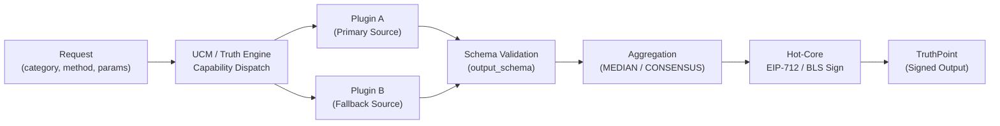
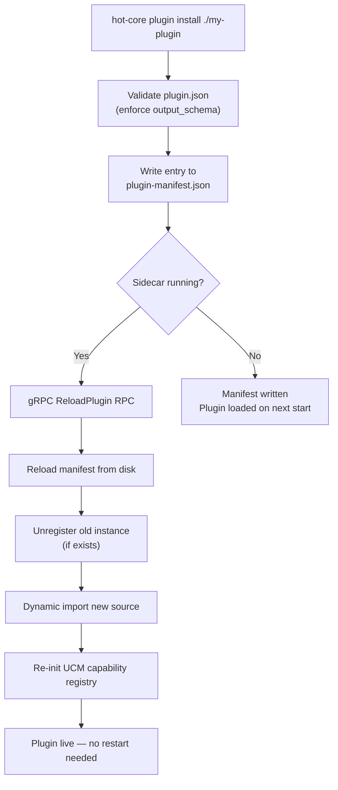

# Plugin System Overview

The TaaS plugin system is the data layer of the protocol. It is intentionally separate from the trust layer. The gateway enforces cryptographic correctness, rate limiting, schema compliance, and on-chain delivery. Plugin authors are responsible for exactly one thing: fetching data correctly from an external API.

A complete plugin is typically 25 to 50 lines of TypeScript.

---

## How Plugins Connect to the Network

Every plugin installed on a gateway node becomes immediately available to the consensus pipeline. The connection point is the **Unified Capability Model (UCM)**, which maps incoming requests to the correct plugin, validates the output, and applies an aggregation strategy before presenting the result to Hot-Core for signing.

---

## Data Categories

The `DataCategory` enum defines the top-level namespace for all plugins. A plugin declares its category in both its code and its `plugin.json` manifest.

| Category | Value | Example Providers |
| :--- | :--- | :--- |
| Crypto | `crypto` | Binance, CoinGecko, CryptoCompare |
| Sports | `sports` | API-Sports, SportDB, SportMonks, The Odds API |
| Forex | `forex` | AlphaVantage, ExchangeRate-API |
| Weather | `weather` | OpenWeather |
| Economics | `economics` | World Bank, FRED (Federal Reserve) |
| Finance | `finance` | Open for contribution |
| On-chain | `onchain` | Open for contribution |
| Social | `social` | Open for contribution |
| Prediction | `prediction` | Open for contribution |
| News | `news` | Open for contribution |
| AI | `ai` | Open for contribution |
| Web | `web` | Open for contribution |
| Calendar | `calendar` | Open for contribution |
| Agent | `agent` | Open for contribution |
| Random | `random` | Open for contribution |
| Custom | `custom` | Operator-defined |

---

## Key Concepts

| Concept | Description | Where |
| :--- | :--- | :--- |
| `SovereignAdapter` | Abstract base class all plugins extend. Provides HTTP client, circuit breaker, SSRF filter, mock mode, and schema validation. | `plugin-sdk` |
| `plugin.json` | Manifest file declaring plugin ID, version, category, and the `output_schema` that UCM enforces at runtime. | Plugin root |
| UCM Capability Registry | JSON files (`core/data/capabilities/<category>.json`) that map method names to aggregation strategy, schema, and minimum source count. | Sidecar core |
| `TruthEngine` | The singleton class that loads capability configs, validates plugin output, and dispatches aggregation strategies. | `lib/ucm/engine.ts` |
| `GuardEngine` | Evaluates pre-resolution state conditions against live data before signing proceeds. | `lib/guards/engine.ts` |
| Hot-Reload | Installs or updates a plugin at runtime without restarting the Sidecar. Triggered via the `ReloadPlugin` gRPC RPC. | `handlers/reload.ts` |

---

## Plugin Lifecycle

---

## Next Steps

- [plugin.json Reference](/plugins/plugin-manifest) — full manifest schema and capability config format.
- [Writing a Plugin](/plugins/writing-a-plugin) — step-by-step guide with a complete code example.
- [Hot-Reload System](/plugins/hot-reload) — how live plugin loading works under the hood.
- [Unified Capability Model](/plugins/ucm) — TruthEngine lifecycle, aggregation strategies, and schema enforcement.
- [State Guards](/plugins/state-guards) — pre-resolution condition checks.
