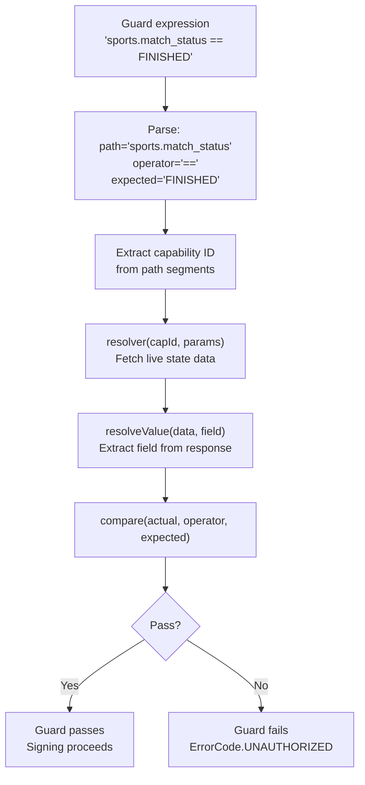

# State Guards

State Guards are pre-resolution conditions that a plugin or capability can declare. A guard is evaluated against live data before the signing step executes. If a guard does not pass, the attestation is blocked and `ErrorCode.UNAUTHORIZED` is returned.

This is most useful in prediction market applications where premature attestations on in-progress events would be harmful — for example, attesting a football match score before the match has reached a `FINISHED` state.

---

## 1. Guard Syntax

Guards are expressed as string expressions in the format:

```
<capability>.<field> <operator> <value>
```

| Part | Description |
| :--- | :--- |
| `<capability>` | A dot-separated path identifying a capability and field. The parent segments identify the capability ID; the final segment is the field name to check. |
| `<operator>` | A comparison operator. |
| `<value>` | The expected value to compare against. String values may be optionally quoted. |

### Supported Operators

| Operator | Type | Description |
| :--- | :--- | :--- |
| `==` | Any | Strict equality (string comparison). |
| `!=` | Any | Strict inequality. |
| `>` | Numeric | Greater than. Non-numeric values always fail this check. |
| `<` | Numeric | Less than. |
| `>=` | Numeric | Greater than or equal to. |
| `<=` | Numeric | Less than or equal to. |

### Examples

```
sports.match_status == FINISHED
crypto.price > 50000
sports.home_score != -1
economics.gdp_growth >= 2.0
```

---

## 2. How Guard Evaluation Works

The `GuardEngine` is a stateless utility class in `lib/guards/engine.ts`. It is invoked before the signing step with three arguments: the guard string, the request parameters, and a `StateResolver` function.



The `StateResolver` function is responsible for fetching the current state of the referenced capability. In the gateway, this typically means a gRPC `ExecutePlugin` call for the referenced category and method, using the same request parameters.

### Example: Evaluation Trace

For the guard `sports.match_status == FINISHED`:

1. `path` = `sports.match_status`, `operator` = `==`, `expected` = `FINISHED`
2. Path segments: `["sports", "match_status"]` — capability ID = `"sports"`, field = `"match_status"`
3. `resolver("sports", { matchId: "12345" })` fetches current match status from the sports plugin.
4. Response: `{ value: { match_status: "FINISHED", home_score: 2, away_score: 1 } }`
5. `resolveValue(data, "match_status")` = `"FINISHED"`
6. `"FINISHED" == "FINISHED"` — guard passes.

---

## 3. Guard Failures

A guard evaluation failure returns `ErrorCode.UNAUTHORIZED`. This is the same code returned for authentication failures, which ensures that a guard block and an auth failure are treated identically by the calling system: neither proceeds to signing.

If the guard expression itself is malformed (fewer than three tokens), an error is thrown and the guard is considered to have failed with an error message describing the parse failure.

| Scenario | Result |
| :--- | :--- |
| Guard condition passes | `{ pass: true, actual: "FINISHED", expected: "FINISHED" }` |
| Guard condition fails | `{ pass: false, actual: "IN_PROGRESS", expected: "FINISHED" }` |
| Resolver throws | `{ pass: false, error: "Source 'sports' not found in category sports" }` |
| Malformed guard string | `{ pass: false, error: "Invalid guard format: 'sports' ..." }` |
| Unknown operator | `{ pass: true }` — logs a warning, defaults to pass to avoid blocking on operator typos |

The `actual` and `expected` fields in the result are always logged, making it straightforward to debug exactly why a guard blocked an attestation.

---

## 4. Security Consideration

Guards fetch live data by invoking the `StateResolver`, which in turn calls a plugin. That plugin call is subject to the same UCM schema validation, circuit breaker protection, and SSRF filtering as any normal request. A guard cannot be used to force a request to an internal endpoint.

State Guard evaluation errors are logged at `ERROR` level with the guard expression and error message. Because guards can block high-value attestations, any guard failure in a production deployment should be treated as operationally significant and investigated promptly.
