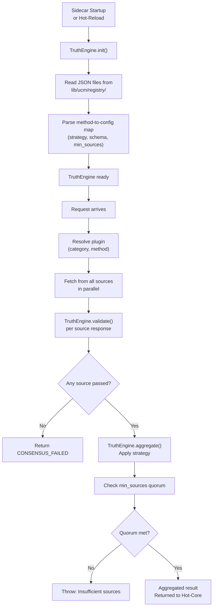

# Unified Capability Model (UCM)

The UCM (Unified Capability Model), implemented as the `TruthEngine` class in `lib/ucm/engine.ts`, is the central dispatcher of the Sidecar. It is the system that connects incoming requests to plugins, enforces output correctness, and reduces multiple data point results into a single authoritative value before presenting it to Hot-Core for signing.

---

## 1. TruthEngine Lifecycle

The `TruthEngine` is a static singleton initialized once during Sidecar boot, and re-initialized on every hot-reload to reflect new capability configurations.



---

## 2. Capability Configuration

The `TruthEngine` loads its configuration from JSON files in `lib/ucm/registry/`. Each file represents a category and contains method-level entries. Every method in the file is keyed by its method name:

```json
{
  "spotPrice": {
    "category": "crypto",
    "aggregation": "MEDIAN",
    "min_sources": 2,
    "schema": {
      "price": "number",
      "symbol": "string",
      "timestamp": "number"
    }
  },
  "orderBook": {
    "category": "crypto",
    "aggregation": "FIRST",
    "min_sources": 1,
    "schema": {
      "bids": "array",
      "asks": "array",
      "timestamp": "number"
    }
  }
}
```

| Field | Type | Description |
| :--- | :--- | :--- |
| `category` | `string` | The `DataCategory` this method belongs to. |
| `aggregation` | `string` | Strategy name used to reduce multiple source results. See Section 3. |
| `min_sources` | `number` | Minimum number of valid source responses required for aggregation to proceed. Defaults to `1`. |
| `schema` | `Record<string, string>` | Shape of the expected plugin output. Used by `TruthEngine.validate()`. |

---

## 3. Aggregation Strategies

The `StrategyRegistry` is a built-in map of named aggregation strategies. The strategy is selected per-method from the capability config. If a strategy name is unknown, the engine warns and falls back to `FIRST`.

| Strategy | Name(s) | Behaviour |
| :--- | :--- | :--- |
| `MedianStrategy` | `MEDIAN` | Sorts numeric values and returns the middle value. Resistant to outliers. Recommended for price feeds. |
| `MeanStrategy` | `MEAN`, `AVG` | Returns the arithmetic mean of all numeric values. Sensitive to outliers. |
| `ConsensusStrategy` | `CONSENSUS`, `MODE` | Returns the most common value across sources (mode). Useful for categorical or event-state data (e.g., match status). |
| `FIRST` | `FIRST` | Pass-through. Returns the first source result without aggregation. Use when only one authoritative source exists. |
| `UNION` | `UNION` | Merges results from all sources into a deduplicated array. Useful when sources return non-overlapping item sets. |

### Choosing a Strategy

| Data Type | Recommended Strategy | Reason |
| :--- | :--- | :--- |
| Price (BTC, ETH) | `MEDIAN` | Resistant to a single provider returning a bad tick. |
| Match score | `CONSENSUS` | Multiple providers must agree on the final scoreline. |
| ETH/USD rate | `MEAN` | Forex rates across brokers are tight — mean is appropriate. |
| Order book | `FIRST` | Order books are provider-specific; aggregation is not meaningful. |
| Fixture list | `UNION` | Combine fixture sets from multiple sport providers into one list. |

---

## 4. Schema Validation

Every plugin response is validated before it enters the aggregation step via `assertSchemaCompliance` in the `executePlugin` handler:

```typescript
function assertSchemaCompliance(
  data: Record<string, unknown>,
  method: string,
  sourceId: string,
): void {
  const result = TruthEngine.validate(data, method, sourceId);
  if (!result.valid) {
    throw new Error(
      `UCM schema violation from source '${sourceId}': ${result.errors.join('; ')}`,
    );
  }
}
```

`TruthEngine.validate()` checks each declared field in the capability schema against the actual response. A field that is missing or has the wrong type causes the validation to fail. The response is discarded. `ErrorCode.SCHEMA_VIOLATION` is returned to Hot-Core.

If no schema is configured for a method (forward-compatible mode), validation is skipped and the data is passed through. This allows new methods to be deployed before their schema is formally registered.

---

## 5. Byzantine Invariant Guards

The `TruthEngine.aggregate()` method enforces two invariants that cannot be disabled:

### Minimum Source Quorum

```typescript
const minSources = config?.min_sources || 1;
if (responses.length < minSources) {
  // Logged at ERROR level with method and count
  throw new Error(
    `Insufficient sources: expected ${minSources}, got ${responses.length}`,
  );
}
```

If fewer valid responses arrive than `min_sources` requires, aggregation is refused. This prevents a consensus value being signed on the basis of a single source when the config requires multiple independent attestations.

### Non-Null Result Guard

```typescript
if (result === undefined || result === null) {
  throw new Error('Aggregation failed to produce a valid truth value');
}
```

After the strategy runs, if the result is null or undefined, aggregation fails. This catches strategy implementation bugs where the input set looks valid but the reduction produces no output.

Both violations are logged at `ERROR` level with a `UCM Invariant Violation` prefix and the method name, making them straightforward to locate in Sidecar logs.

---

## 6. Getting the Capability Config

You can inspect the loaded capability config for any method from the Sidecar's `TruthEngine`:

```typescript
// Returns the CapabilityConfig for a method, or undefined if not registered.
const config = TruthEngine.getCapability('spotPrice');
// { category: 'crypto', aggregation: 'MEDIAN', min_sources: 2, schema: { ... } }

// Returns all loaded capabilities as a plain object.
const all = TruthEngine.getAllCapabilities();
```

This is useful when debugging why a particular method is not being recognized or is using an unexpected aggregation strategy.
